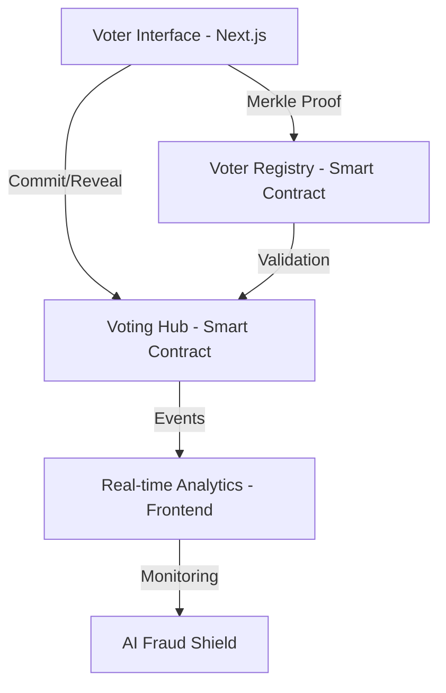

# 🗳️ BlockVox: The Team Handover & Project Master Guide
## *From Concept to Sovereign Governance*

This document serves as the comprehensive blueprint for **BlockVox**. It is designed to help you explain the project’s DNA—from its architectural foundation to its future as a state-of-the-art e-voting standard.

---

## 1. The Core Architecture
BlockVox is built on a **Modular Trinitarian Architecture**:

### 🔹 Why This Structure?
- **Separation of Concerns**: The frontend handles the complex UX, while the blockchain solely handles the **Truth** (State).
- **Privacy First**: By keeping voter IDs in Merkle Trees, we never store PII (Personally Identifiable Information) on-chain.

---

## 2. Tech Stack & "The Why"

| Technology | Purpose | Strategic Reasoning |
| :--- | :--- | :--- |
| **Avalanche (Fuji)** | Layer 1 Blockchain | Sub-second finality. Unlike Ethereum (12s) or Polygon (2s), Avalanche feels "instant," which is critical for voter trust. |
| **Next.js 15 + React 19** | Frontend Framework | Uses Server Components for speed and SEO. React 19 provides the high-fidelity state management needed for complex multi-step voting. |
| **Solidity ^0.8.24** | Smart Contracts | The industry standard. We used the latest version to ensure security against known exploits like re-entrancy. |
| **Viem & Wagmi** | Web3 Orchestration | Much lighter and faster than Ethers.js. It allows for "Type-Safe" interactions with our contracts. |
| **Framer Motion** | Motion Design | Aesthetics = Legitimacy. A "premium" looking app builds user confidence in a way a basic HTML form can't. |

---

## 3. The "Secret Sauce" Protocols

### 🔒 The Commit-Reveal Handshake
**The Problem**: If people see live results (e.g., Candidate A is leading), they might change their mind to "stop" a candidate rather than voting for who they like.
**Our Solution**: 
1. **Commit**: You send a secret hash. No one knows your choice.
2. **Reveal**: You "unlock" the hash later. 
*Result: 100% fairness. No one knows the winner until the final second.*

### 🌳 Merkle-Tree Whitelisting
**The Problem**: Staging 10,000 voter addresses in a database is expensive and a privacy risk.
**Our Solution**: We hash the entire list into one 32-byte string (The Root). 
*Result: The contract only knows the "Root." The user proves they are on the list with a "Proof." It's fast, cheap, and private.*

---

## 4. The Development Journey (From Scratch to Final)

1. **Phase 1: The Ledger**: We wrote the `BlockVoxVoting.sol` contract. We didn't just make a "tally" system; we built an immutable proof-of-intent engine.
2. **Phase 2: The Bridge**: We built the `/frontend/lib` folder to handle the complex math of Merkle Trees and Keccak hashes so the user doesn't have to.
3. **Phase 3: The Experience**: We implemented the "Fluid UI"—ensuring that connecting a wallet, committing, and revealing felt like one smooth journey.
4. **Phase 4: The Transparency**: We added the **AI Fraud Shield** and **Fairness Simulator**. This moves the project from a "tool" to a "platform" that educates users on democratic theory.

---

## 5. Operation Guide: How to Run This
To demo or deploy this today, follow these steps:
1. **Seed the Registry**: Use the `/admin` suite to upload your CSV of eligible wallets.
2. **Verify Roots**: Ensure the Merkle Root on-chain matches the local computation.
3. **Simulate Load**: Use the "Simulator" to cast 50-100 votes to show the real-time tallying speed.
4. **Audit the Ledger**: Show the Snowtrace link to prove that every action is publicly verifiable.

---

## 6. The "Level Best" Upgrade Path (Roadmap)

To make this the global gold standard for e-voting, here are the next 3 levels:

### 🥉 Level 1: Privacy Overdrive (ZK-SNARKs)
- **Current State**: Anyone can see your wallet address voted.
- **Objective**: Use Zero-Knowledge Proofs (like Semaphore) so a user can prove they are a student *without* revealing which wallet is theirs. **Total Anonymity.**

### 🥈 Level 2: Scalable Governance (Avalanche Subnets)
- **Current State**: We are on a shared Testnet.
- **Objective**: Spin up a dedicated **BlockVox Subnet**. 
- **Reason**: This gives us "Sovereign Throughput." No one else's transactions can slow down an election. We can even pay gas in a native "VOX" token.

### 🥇 Level 3: The Human Element (WebAuthn / Passkeys)
- **Current State**: Users need a Metamask/Core wallet.
- **Objective**: Integrate **Passkeys**.
- **Reason**: Users could vote using their **FaceID or Fingerprint** on their phone. This removes the "Wallet Barrier" and makes it usable by anyone, not just crypto experts.

---

## 7. The Philosophy for the Team
When presenting this, emphasize one thing: **BlockVox isn't about counting votes; it's about proving the count is honest.** 

In a world of deepfakes and misinformation, BlockVox provides a **Cryptographic Source of Truth.**

---

**Developed with ❤️ for the PVG Nashik Team.**
